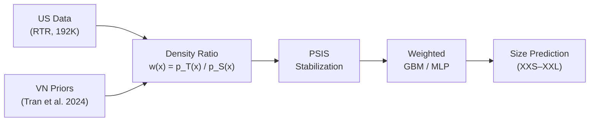
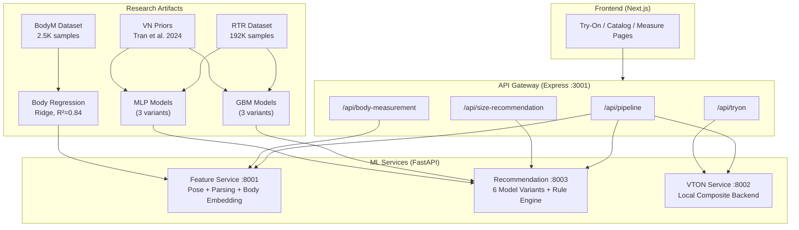
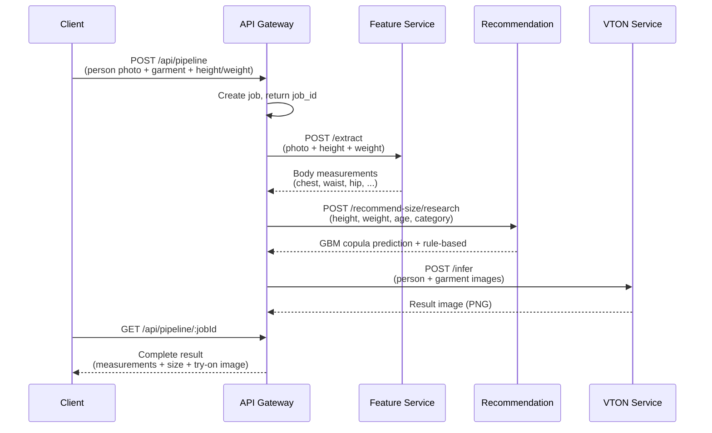
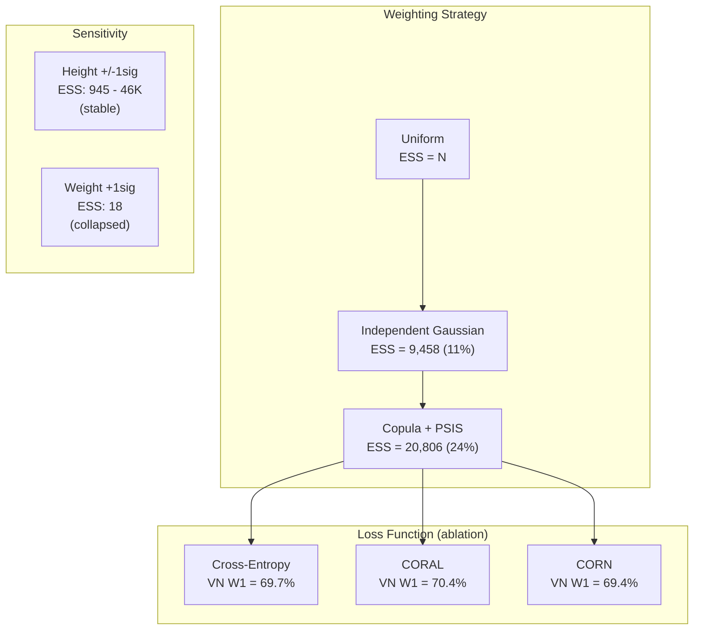

# EA-VTON: Ethnicity-Aware Virtual Try-On

A full-stack system that combines **cross-population size recommendation** with **virtual try-on**. Given a person photo + height/weight, it predicts the best garment size using Vietnamese-adapted importance weighting on US training data, then composites the garment onto the person.

> Research project exploring population-aware sizing via copula density ratio estimation and ordinal classification.

---

## Description

Standard size recommendation models are trained on Western body data (e.g., Rent The Runway's 192K US users). Directly applying these models to Vietnamese users produces systematic mis-sizing — the US population is taller and heavier on average, so US-trained models over-predict sizes for Vietnamese bodies.

EA-VTON addresses this by **reweighting** US training samples to match Vietnamese body distributions using copula-based density ratio estimation with Pareto Smoothed Importance Sampling (PSIS). Each US sample gets a weight proportional to how "Vietnamese-like" its height/weight pair is, allowing us to train on abundant US data while optimizing for Vietnamese accuracy.

The system serves predictions through a microservice architecture with a Next.js frontend, Express API gateway, and three FastAPI ML services.

---

## Methodology

### Core Research: Cross-Population Transfer

The research contribution is a pipeline for adapting a size recommendation model trained on Source population S (US/RTR) to perform well on Target population T (Vietnamese):



**Step 1 — Copula Density Ratio Estimation**

Model the joint distribution of height and weight for both populations using Gaussian copulas. The density ratio `w(h, w) = p_VN(h, w) / p_US(h, w)` gives each US training sample an importance weight reflecting how likely that body shape is in the Vietnamese population.

The copula captures the height-weight correlation (r = 0.388), which independent Gaussian weighting misses. This yields 2.2x higher Effective Sample Size (ESS: 24% vs 11%).

**Step 2 — PSIS Stabilization**

Raw importance weights have heavy tails (max weight ~110x). Pareto Smoothed Importance Sampling (Vehtari et al., JMLR 2024) fits a Generalized Pareto Distribution to the tail, capping extreme weights. This brings max weight down to ~57x and provides the k-hat diagnostic (k < 0.5 = reliable).

**Step 3 — Weighted Classification**

Train gradient-boosted trees (GBM) and MLPs on the reweighted data. We evaluate three loss functions:
- **Cross-Entropy (CE)** — standard classification
- **CORAL** — cumulative ordinal logits (Cao et al., AAAI 2020)
- **CORN** — conditional ordinal (Shi & Raschka, PAA 2023)

**Step 4 — Body Measurement Estimation**

Ridge regression trained on Amazon BodyM (2,507 subjects; 2,018 train / 489 test) maps height + weight + gender to 6 body measurements (chest, waist, hip, shoulder, arm, leg). Mean R² = 0.85, avg MAE = 2.10 cm.

### Engineering: Virtual Try-On

The VTON component is engineering-only (no novel contribution). It uses a local composite backend:
1. Detect torso region via luminance variance analysis
2. Resize garment to fit detected torso
3. Alpha-composite with feathered edges, shadow synthesis, and color correction

---

## System Architecture



### Full Pipeline Flow



---

## Step-by-Step Walkthrough

### 1. Data Preparation

```
research/datasets/raw/           # Raw data (RTR 192K, BodyM 2.5K)
research/datasets/scripts/       # Processing + VN adaptation
research/datasets/processed/     # Clean parquet + VN priors (JSON)
```

- **RTR**: 192,544 self-reported body stats (height, weight, age, body type, size, fit feedback)
- **BodyM**: 2,507 subjects with 14 precise body measurements from silhouette images
- **VN Priors**: 5 body type clusters from Tran et al. (2024) with population percentages

### 2. Importance Weighting

```
research/weighting/copula_psis.py   # Gaussian copula + PSIS
research/models/retrain_gbm_density_ratio.py  # Refresh served tuned GBM artifacts
```

The copula models joint P(height, weight) for US and VN populations. The served
GBM artifacts recompute weights on the valid fit-only training split before
training, so diagnostics are tied to that split rather than the full raw RTR
file.

| Population | Height | Weight | Correlation |
|-----------|--------|--------|-------------|
| US fit training split | mean 165.6 cm | mean 60.3 kg | 0.456 |
| VN target (Tran et al.) | mean 156.2 cm, std 5.5 cm | mean 53.9 kg, std 8.0 kg | US correlation reused |

Density ratio: `w(h,w) = phi_VN(h,w) / phi_US(h,w)` where phi is the copula density.
Raw Copula+PSIS on 86,379 fit-only training samples: ESS = 20,806 (24.1%), k-hat = -0.001.
The served `gbm_copula_tempered_a075` artifact uses `w^0.75` tempering and now records alpha-adjusted ESS = 32,355 (37.5%), max weight = 25.06, p99 = 6.20.

### 3. Model Training

```
research/models/variants/          # 6 trained model bundles (.pkl, .pt)
training/scripts/train_size_mlp.py # MLP training with importance weights
```

**Served tuned GBM variants** are regenerated by `research/models/retrain_gbm_density_ratio.py`:

| Variant | Full Acc | Full W1 | VN Acc | VN W1 | VN Bias |
|---------|----------|---------|--------|-------|---------|
| gbm_uniform_current | **49.0%** | **83.4%** | 50.7% | 70.1% | **-0.172** |
| gbm_indep_tempered_a05 | 48.9% | 83.1% | **51.5%** | 70.9% | -0.187 |
| gbm_copula_current | 48.5% | 83.2% | 51.4% | 70.7% | -0.199 |
| gbm_copula_tempered_a075 | 48.7% | 83.2% | 51.4% | **71.0%** | -0.213 |

Model serving is population-aware and exact-accuracy first: `gbm_uniform_current` is preferred for `us_women`/`universal` requests because it has the best full-test accuracy, while `gbm_indep_tempered_a05` is preferred for `vietnamese` requests because it has the best VN-range top-1 accuracy. `gbm_copula_tempered_a075` remains available for comparison/research and has the best VN-range within-1 accuracy.

### 4. Body Measurement Estimation

```
research/models/body_regression/    # Ridge regression model
research/models/train_body_regression.py
```

Ridge regression on BodyM data: 4 features (height, weight, BMI, gender) -> 6 measurements.

| Measurement | MAE (cm) | R² |
|-------------|----------|-----|
| Chest | 3.10 | 0.90 |
| Waist | 3.47 | 0.90 |
| Hip | 2.28 | 0.93 |
| Shoulder | 0.80 | 0.88 |
| Arm length | 1.18 | 0.71 |
| Leg length | 1.77 | 0.71 |

### 5. Service Deployment

```
services/recommendation/    # FastAPI :8003 — loads 6 model variants
services/feature-service/   # FastAPI :8001 — pose + body estimation
services/vton-service/      # FastAPI :8002 — garment compositing
apps/api/                   # Express :3001 — orchestrates services
apps/web/                   # Next.js :3000 — user interface
```

### 6. Ablation Studies

```
research/evaluation/ablation_studies.py
research/evaluation/ablation_results.json
```

Key ablation findings:



- **Copula > Independent**: 2.2x higher ESS via height-weight correlation modeling
- **PSIS**: Smooths tail weights (max 30.6 -> 10.2 on full data), improves stability
- **CORAL > CE > CORN** (ablation, separate training run): CORAL best for VN ordinal prediction (W1 = 70.4%, bias = -0.203)
- **Weight sensitivity**: Method collapses when weight target > 1 sigma from source (ESS -> 18)

---

## Project Structure

```
research-try-out/
├── apps/
│   ├── api/                    # Express gateway (:3001)
│   │   └── src/routes/         # pipeline, size, tryon, body, features, health
│   └── web/                    # Next.js frontend (:3000)
│       └── src/app/            # try-on, catalog, measure, profile pages
│
├── services/
│   ├── feature-service/        # FastAPI (:8001) — pose, parsing, body embedding
│   ├── recommendation/         # FastAPI (:8003) — 6 model variants + rule engine
│   └── vton-service/           # FastAPI (:8002) — local composite try-on
│
├── research/
│   ├── datasets/               # RTR (192K), BodyM (2.5K), VN priors
│   │   ├── raw/                # Original data files
│   │   ├── processed/          # Clean parquet + JSON
│   │   └── scripts/            # Processing pipelines
│   ├── evaluation/             # Eval scripts + ablation results (JSON)
│   ├── models/                 # Trained models + training scripts
│   │   ├── variants/           # 6 GBM/MLP model bundles
│   │   └── body_regression/    # Ridge regression for measurements
│   └── weighting/              # Copula + PSIS implementation
│
├── training/
│   ├── configs/                # YAML configs (vton, size_mlp, body_embedding)
│   ├── scripts/                # Training entry points
│   └── checkpoints/            # Saved weights
│
├── paper/                      # LaTeX paper draft
├── docs/                       # Technical documentation (10 chapters)
├── data/                       # Processed datasets (parquet) + download scripts
├── packages/                   # Shared TS types + SDK
├── docker-compose.yml          # Full stack orchestration
├── turbo.json                  # Turborepo build config
└── pnpm-workspace.yaml         # Monorepo workspace config
```

---

## Quick Start

### Prerequisites

- Python 3.11+ with virtualenv
- Node.js 18+ with pnpm
- Trained models in `research/models/variants/` (6 `.pkl` / `.pt` files)

### Run All Services

```bash
# 1. Install dependencies
python3 -m venv .venv && source .venv/bin/activate
pip install fastapi uvicorn numpy torch scikit-learn scipy pandas pillow

cd apps/api && pnpm install && cd ../..

# 2. Start ML services
uvicorn src.app:app --port 8001 --app-dir services/feature-service &
uvicorn src.app:app --port 8003 --app-dir services/recommendation &
uvicorn src.app:app --port 8002 --app-dir services/vton-service &

# 3. Start API gateway
cd apps/api && node src/index.js &

# 4. Start frontend
cd apps/web && pnpm dev
```

### Or via Docker

```bash
docker-compose up
```

### Verify

```bash
# Health checks
curl http://localhost:8001/health   # Feature service
curl http://localhost:8002/health   # VTON service
curl http://localhost:8003/health   # Recommendation (shows 6 loaded variants)
curl http://localhost:3001/         # API gateway

# Quick size prediction (no photo needed)
curl -X POST http://localhost:3001/api/pipeline/quick \
  -H "Content-Type: application/json" \
  -d '{"height_cm": 156.2, "weight_kg": 53.9, "population": "vietnamese"}'

# Compare all 6 model variants
curl -X POST http://localhost:3001/api/size-recommendation/all-models \
  -H "Content-Type: application/json" \
  -d '{"height_cm": 156.2, "weight_kg": 53.9}'

# Full pipeline (photo + garment + measurements + try-on)
curl -X POST http://localhost:3001/api/pipeline \
  -F "person=@person.jpg" \
  -F "garment=@garment.png" \
  -F "height_cm=156.2" \
  -F "weight_kg=53.9"
```

---

## API Endpoints

| Method | Path | Description |
|--------|------|-------------|
| `POST` | `/api/pipeline` | Full pipeline: photo + garment -> measurements + size + VTON |
| `GET` | `/api/pipeline/:id` | Poll pipeline job status |
| `POST` | `/api/pipeline/quick` | Height + weight only -> size recommendation |
| `POST` | `/api/size-recommendation` | Rule-based size prediction with size chart |
| `POST` | `/api/size-recommendation/research` | GBM copula model prediction |
| `POST` | `/api/size-recommendation/all-models` | Compare all 6 trained variants |
| `POST` | `/api/size-recommendation/compare` | US vs VN population comparison |
| `POST` | `/api/tryon/simple` | Upload person + garment -> try-on |
| `POST` | `/api/body-measurement` | Photo + height/weight -> body measurements |
| `GET` | `/api/health` | Gateway health check |

---

## Tech Stack

| Layer | Technology |
|-------|-----------|
| Frontend | Next.js 15, TypeScript, Tailwind CSS |
| API Gateway | Express.js, Multer, UUID |
| ML Services | FastAPI, Uvicorn, Python 3.11+ |
| Size Models | scikit-learn GBM, PyTorch MLP |
| Body Estimation | Ridge regression (BodyM-trained), MediaPipe fallback |
| VTON | PIL-based composite with alpha blending |
| Build System | Turborepo, pnpm workspaces |
| Containerization | Docker Compose |
| Datasets | RTR (192K), BodyM (2.5K), VN priors (Tran et al. 2024) |

---

## Key Results

**Best practical model**: GBM + Copula + PSIS

- Full test accuracy: 48.5% (within-1: 83.2%)
- Vietnamese-range accuracy: 51.4% (within-1: 70.7%)
- End-to-end pipeline latency: ~770ms (body measurement + size rec + VTON)

**Honest limitation**: The GO/NO-GO evaluation showed MLP + CORN + copula does NOT improve over GBM on Vietnamese bodies. The copula weighting helps GBM more than MLP, and CORN underperforms CORAL for ordinal classification in this domain.

---

## Documentation

Detailed technical docs in `docs/`:

| Doc | Topic |
|-----|-------|
| `01-system-architecture.md` | System overview |
| `02-body-measurement-estimation.md` | MediaPipe + regression approach |
| `03-importance-weighted-sampling.md` | Copula + PSIS theory |
| `04-size-recommendation.md` | Size engine design |
| `05-virtual-tryon-pipeline.md` | VTON pipeline details |
| `08-benchmarks.md` | Model benchmarks |
| `10-research-plan.md` | Research roadmap |

---

## License

Research project. Code is provided as-is for academic purposes.
