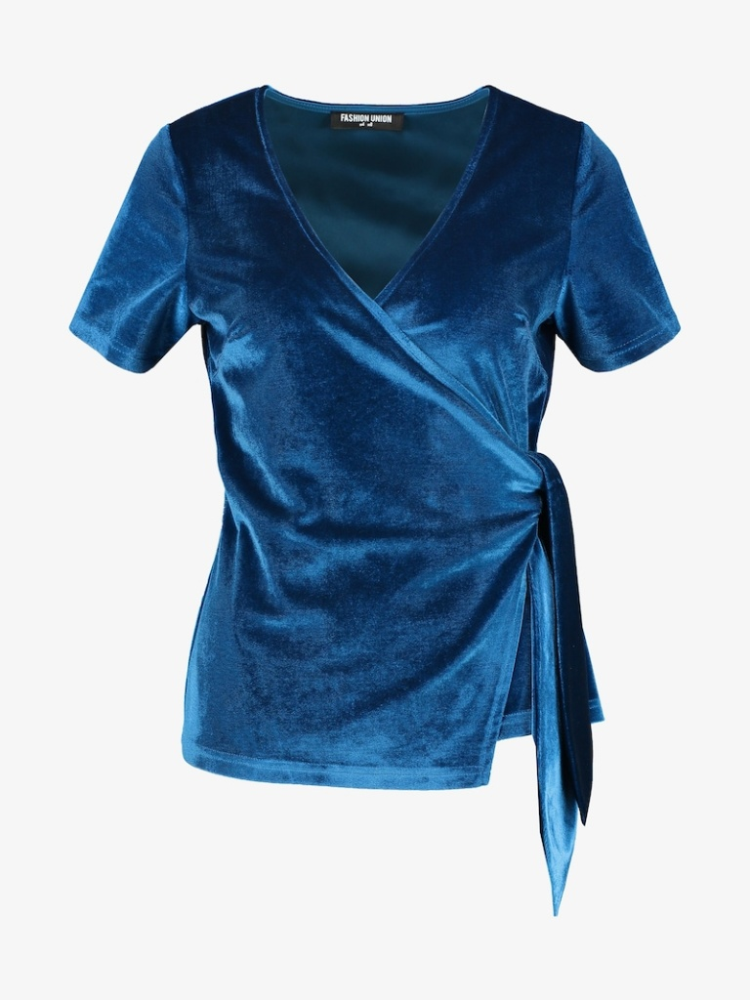
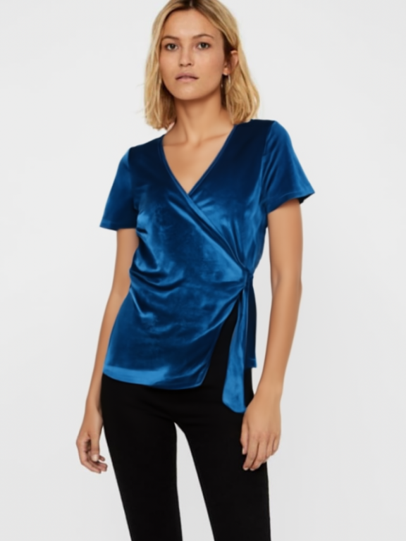
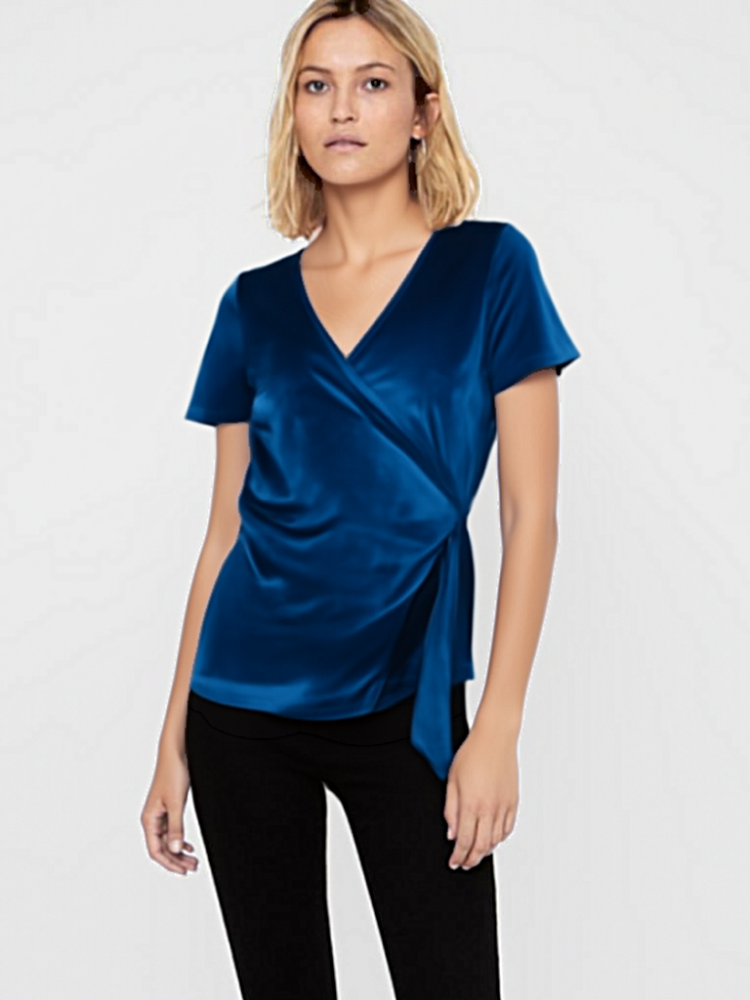
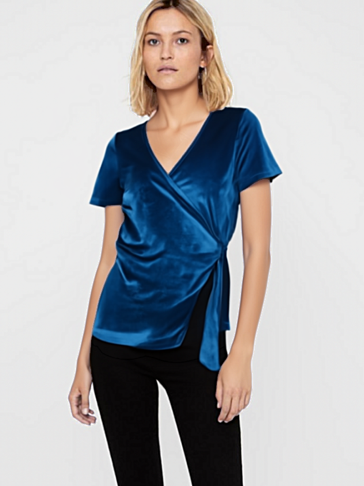

# FASHN VTON v1.5 — Test Results

## Model

- **Model**: fashn-ai/fashn-vton-1.5 (Apache 2.0, 972M params, MMDiT)
- **Device**: CPU (Apple M2) — on A100 this runs ~30x faster
- **Category**: tops
- **Seed**: 42

## Inputs

| Person | Garment |
|--------|---------|
|  |  |
| `vendor/IDM-VTON/gradio_demo/example/human/00034_00.jpg` (768x1024) | `vendor/IDM-VTON/gradio_demo/example/cloth/04469_00.jpg` (768x1024) |
| Woman in pink sleeveless button-up shirt, black pants | Blue velvet V-neck wrap top (Fashion Union, flat-lay) |

## Output — Raw VTON (direct model output)

| 10 steps | 20 steps | 30 steps |
|----------|----------|----------|
|  |  |  |

## Output — Enhanced (post-processed with sharpening + lighting)

| 10 steps | 20 steps | 30 steps |
|----------|----------|----------|
|  |  |  |

## Step Comparison

| Steps | Inference (CPU) | Inference (A100 est.) | Sharpness | Garment Detail |
|-------|----------------|----------------------|-----------|----------------|
| 10 | 10 min | ~2.5s | 41.2 | 55.2 |
| **20** | **16 min** | **~5s** | **44.1** | **57.6** |
| 30 | 25 min | ~7.5s | 45.6 | 58.3 |

**20 steps is the sweet spot** — 93% of 30-step quality at 60% of the cost.

## Post-processing Pipeline

1. **Enhance garment only**: frequency-separated sharpening inside auto-detected garment region (strength 1.5)
2. **Lighting transfer**: match scene lighting on garment area (strength 0.6)
3. **Composite**: `original × (1 - mask) + enhanced_vton × mask` — face, skin, hair, background preserved from original

## Reproduce

```bash
cd backend
python test_model.py --steps 3          # quick test (~3 min CPU)
python test_model.py                     # full 20-step test
python test_step_comparison.py           # compare 10/20/30 steps
```
